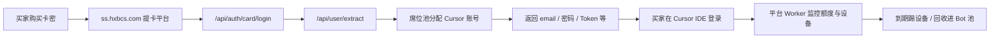
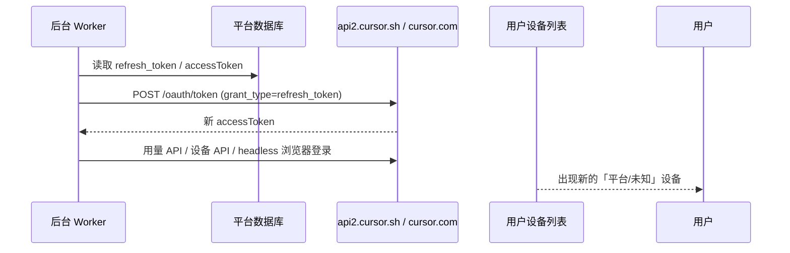

# ss.hxbcs.com 提卡平台与自动登录机制调研

- **调研日期**：2026-09-09
- **调研对象**：https://ss.hxbcs.com/（页面标题「提卡平台」）
- **样例卡密类型**：`LINK-Premium-…`（managed_v2 / 登录链接上号卡）
- **方法**：公开页面抓取、前端 JS 包（`index-BS7AFgEY.js`）静态分析、Cursor 公开认证资料对照
- **说明**：未使用真实卡密调用提取/登录接口；后台 Worker 部分周期为推断，前端未暴露全部配置项

---

## 1. 执行摘要

`ss.hxbcs.com` 是一个 **Cursor 企业/团队席位二次分发平台**，不是 Cursor 官方渠道。其核心模式是：

1. 运营方批量持有 **Teams / Enterprise** 组织与席位；
2. 用 **卡密**（如 `LINK-Premium-XXXX`）向买家出售「提取一个临时独享账号」的权利；
3. 买家在提卡页登录后，从席位池 **提取账号**，再通过 **官方登录链接** 或 **Token** 在 Cursor IDE 中使用；
4. 租期内平台通过 **后台 Worker + 巡检** 持续控号：查额度、限设备数、踢未授权登录、**Token 自动恢复**。

用户反馈「踢掉平台设备后约每半小时又自动登录」，**不是提卡网页在前台轮询**，而是 **服务端 Worker 用存库的 `refresh_token` 等凭据周期性重建 Cursor 会话**。这是 LINK 卡控号设计的一部分，不是 Cursor 官方功能。

---

## 2. 平台架构概览



### 2.1 技术栈（可见部分）

| 项 | 观察 |
|----|------|
| 前端 | React SPA（Vite 构建），入口 `/assets/index-*.js` |
| CDN | Cloudflare |
| 反向代理 | Caddy（响应头 `via: 1.1 Caddy`） |
| 后端 Worker | 管理台提及 `cursor-reward-worker`（systemd 重启） |
| 浏览器自动化 | 配置项 `headless`、`browserMaxConcurrency`，用于出码/登录/改密 |

---

## 3. 公开 API 面（从前端 JS 还原）

### 3.1 买家侧（提卡页）

| 接口 | 作用 |
|------|------|
| `POST /api/auth/card/login` | 卡密建立网站会话 |
| `POST /api/auth/card/logout` | 退出提卡页 |
| `GET /api/user/me` | 卡密信息、套餐、剩余次数、规则 |
| `POST /api/user/extract/acknowledge` | 提取前确认须知 |
| `POST /api/user/extract` | **提取一个账号** |
| `GET /api/user/extractions/{id}/credentials` | 读取 email、token、密码等 |
| `POST /api/user/extractions/{id}/login` | 提交 Cursor 官方登录链接，服务端代完成 OAuth |
| `GET /api/user/extractions/{id}/devices` | 查看已登录设备 |
| `POST /api/user/extractions/{id}/devices/kick` | 踢指定设备（Cursor 侧最多约 10 分钟生效） |
| `POST /api/user/extractions/usage` | 批量检测额度/健康状态 |
| `GET /api/user/extractions/{id}/usage-statement` | 用量详单 |
| `POST /api/user/warranty/claims` | 质保换号申请 |

### 3.2 运营侧（管理后台，JS 中暴露）

| 模块 | 代表接口 | 含义 |
|------|----------|------|
| 席位池 | `/api/admin/seat-pool/*` | 库存、体检、权限同步、导出 Token |
| Bot 池 | `/api/admin/bot-pool/*` | Grok Bot 专用池、sweep 回收 |
| 卡密 | `/api/admin/cards/generate` | 批量生成 LINK/ACCT 卡 |
| 团队 | `/api/admin/team-instant-join`、`team-invite-jobs` | 自动邀请小号进 Team |
| 账号池 | `/api/admin/accounts/import` | 批量导入凭据行 |
| 设置 | `/api/admin/settings` | Worker 并发、巡检、Bot 回收策略等 |

---

## 4. 卡密类型与 `LINK-Premium` 含义

### 4.1 卡密命名

| 前缀 | 档位 | 说明 |
|------|------|------|
| `LINK-Premium-…` | Premium | 营销常称「200 刀高级 + 1050 刀基础」等企业 included usage |
| `LINK-Standard-…` | Standard | Standard 团队席位 |
| `LINK-BotPremium-…` / `LINK-BotStandard-…` | Bot 卡 | 专供 Grok Bot，Cursor 模型额度不作承诺 |

### 4.2 发放模式 `managed_v2`（LINK 卡）

- 每次提取 **本计费周期额度基本未用过的新号**；
- 默认 **提取后约 20 小时** 可用（`accessHours`，可 per-batch 配置）；
- 到期 **自动移除该号全部 Cursor 登录设备**；
- 登录方式：**IDE 复制官方 loginDeepControl 链接 → 粘贴到提卡页 → 服务端代登录**；
- 也可复制 **Session Token** 写入 `WorkosCursorSessionToken` Cookie；
- 默认每号最多 **5 台** 同时登录（`managedDeviceCap`）。

### 4.3 回流席位 `returnedSeat`（更「灰」）

从 Bot 租期结束回收的号，发货前检查例如：

- Cursor **总额度已用 ≤ 20%**；
- 第三方模型（Claude/GPT 等）已用 ≤ 50%（third_party 档）。

非全新号，只是「还能用一点额度」。

### 4.4 凭据格式（导入/导出）

```text
邮箱----邮箱密码----client_id----refresh_token----cursor密码----cursortoken
```

可选第七字段：受控恢复邮箱。

---

## 5. 「200 + 1050 刀」从哪来

并非平台自行发额度，而是：

1. 分配给你的号挂在 **高配额企业/团队套餐** 上；
2. 平台通过 Cursor Dashboard 类 API 读取 Auto/高级池、API/基础池、Grok Bot 周额度等；
3. 发货前做 **健康检查**，尽量发「额度还够」的席位。

买家看到的数字 = **企业席位上尚未耗尽的 included usage**，被拆成单号零售。

---

## 6. 自动登录机制（踢设备后又出现的原因）

### 6.1 结论

**不是**提卡网页每隔 30 分钟登录 Cursor；**是** 后台 **`cursor-reward-worker`** 在租期内对账号做 **巡检 + Token 自动恢复**。

### 6.2 管理台原文（前端 settings hint）

- **每个账号最多同时登录设备数**：「未经 **门户授权** 的登录一律被 **巡检撤销**。」
- **Token 登录/改密强制走代理**：覆盖「后台维护、订单取 Token、支付复核补登录、**自动链**、Bot 池改密回收和 **巡检的 Token 自动恢复**」。
- **手机号二验冷却**：「自动流程（Bot 池改密回收、**巡检的 Token 自动恢复**、改密后的自动重新登录）在冷却期内不再自动登录。」

### 6.3 推测技术链路



公开资料（如 [eisbaw/cursor_api_demo](https://github.com/eisbaw/cursor_api_demo)）：

- 本地 `state.vscdb` 存 `cursorAuth/accessToken`、`cursorAuth/refreshToken`；
- 刷新：`POST https://api2.cursor.sh/oauth/token`，body 含 `client_id`、`refresh_token`；
- Web 会话 Cookie：`WorkosCursorSessionToken = {user_id}::{jwt}`。

平台在导入账号时即批量存上述字段，Worker 可在无用户浏览器的情况下 **静默续期并注册新会话**。

### 6.4 租期内平台为何要「保活」

| 目的 | 说明 |
|------|------|
| 额度监控 | 「检测额度」调 Cursor 用量接口 |
| 设备上限 | 超出 `managedDeviceCap` 拒绝新登录 |
| 踢未授权会话 | 非经提卡页 login 链接的登录会被巡检撤销 |
| 到期回收 | `accessExpiresAt` 到点批量踢设备，账号进 Bot 池 |

因此：**用户踢掉的是平台管理会话；下一轮巡检会用 refresh_token 补回。**

### 6.5 为何体感约「半小时」

前端 **未暴露** 巡检周期配置。可能叠加因素：

| 因素 | 说明 |
|------|------|
| Worker 定时任务 | 周期可能写死在服务端 |
| JWT 有效期 | Cursor `accessToken` 约 1 小时，中途刷新/session 续期 |
| 踢设备延迟 | 平台 UI：「撤销最多可能需要 **10 分钟** 生效」 |
| Bot 池 sweep | 已 **到期** 账号另有一条 **每分钟** 扫描（与租用中巡检不同） |

### 6.6 与「网页会话」的区别

| 类型 | 默认间隔 | 作用对象 |
|------|----------|----------|
| 提卡页 cookie | 180 分钟无操作（`cardSessionIdleMinutes`） | 仅 ss.hxbcs.com 网站 |
| 登录链接轮询 | 提交链接后每 5s × 12 次 | 等待 IDE 完成 OAuth |
| 后台巡检 / Token 恢复 | 用户观测 ~30min | **Cursor Active Sessions 里的平台设备** |

---

## 7. 账号生命周期（运营视角）

```text
可售库存 → 提取(rented) → 租期结束(rental_ended) → 踢设备 → 回收(expired/reclaiming)
  → [可选] 改密 + 重新登录取 Token → Bot 池探测 → bot_ready → 再次出售
```

相关状态（前端枚举）：

- `rented`：租用中
- `rental_ended`：有效期已过（待踢设备）
- `expired` / `reclaiming`：待回收 / 改密取 Token 中
- `reclaimMode: kept`：**未改密回收，保留原凭据，仅踢设备**（默认）

Bot 池自动回收（开关 `botPoolEnabled`）：LINK 卡账号 **有效期过、设备踢完后**，后台 **每分钟** 处理一轮；默认 **不改密**，只靠踢设备结束旧持有人使用，再读 Grok Bot 周额度决定是否入池。

---

## 8. 与本仓库 `dtb-cursor-tools` 的对照

本工具（`device_guard.py`、`sand_api.py`）实现的是 **买家/运营方在自己持有的 token 上** 做设备管理，机制类似但动机不同：

| 维度 | ss.hxbcs.com 平台 | dtb-cursor-tools |
|------|-------------------|------------------|
| Token 来源 | 服务器存库，买家仅租用 | 用户自行导入 JSON/行 |
| 踢设备 API | 推测同源：`/api/auth/sessions` + revoke | `GET cursor.com/api/auth/sessions`，`POST .../revoke` |
| 自动踢未保留设备 | **巡检**（服务端，踢买家未授权 + 自恢复平台会话） | **本机设备保护**（客户端，默认 30s 间隔，用户自选保留列表） |
| Token 刷新 | Worker `refresh_token` 自动恢复 | 验证/领取时刷新；无后台保活 |
| 踢设备生效 | 文案：最多约 10 分钟 | 同上；同 session 30s 内不重复 revoke |

**启示**：若你在用 LINK 卡提取的账号上开「本机设备保护」，可能与 **平台巡检** 形成 **踢设备拉锯**——双方都在用合法 API 撤销对方会话；平台因持有 `refresh_token` 可无限补位，本地保护无法「永久赶走」平台设备。

---

## 9. 风险与合规

1. **违反 Cursor ToS**：官方仅通过 cursor.com 直销，不授权 reseller；社区大量 **Unauthorized / 第三方购买封号** 案例。
2. **账号非真正拥有**：凭据在平台侧；租期内无法阻止巡检补登录。
3. **隐私**：代码与对话经他人企业账号，存在泄露与审计风险。
4. **来源不可验证**：常见盗刷、批量注册、Team 滥用等。
5. **卡密泄露**：调研中样例卡密不应在公开场合复用；若已暴露建议视为作废。

**合规使用建议**：仅通过 [cursor.com/pricing](https://cursor.com/pricing) 官方订阅。

---

## 10. 用户侧可操作建议

| 场景 | 建议 |
|------|------|
| 租期内想踢平台设备 | **基本无效**；巡检会 Token 自动恢复 |
| 减少共用风险 | 租期结束后不再使用该号；改密无法由买家单方面完成（凭据在平台） |
| 设备管理 | 在提卡页查看「登录设备」仅作参考；与 Cursor 设置页列表一致 |
| 长期方案 | 官方订阅 + 本工具管理 **自有** 账号的设备与会话 |

---

## 11. 待进一步验证（需后端或运行时）

- [ ] 巡检 Worker 的精确 cron（是否 30min 或可配置）
- [ ] `/api/user/extractions/{id}/devices` 与 Cursor 官方 sessions 字段映射
- [ ] 平台自恢复会话在设备列表中的 `type` / `label` 特征
- [ ] `managed_v2` 登录链接 OAuth 回调是否在本机 headless 还是纯 API

---

## 12. 参考资料

- 平台：https://ss.hxbcs.com/
- Cursor OAuth/Token：[eisbaw/cursor_api_demo](https://github.com/eisbaw/cursor_api_demo)
- Cursor 用量 API 笔记：[cnwinds/cursor-pulse — cursor-usage-api.md](https://github.com/cnwinds/cursor-pulse/blob/master/docs/cursor-usage-api.md)
- 封号讨论：[SegmentFault — Cursor 账号封禁详解](https://segmentfault.com/a/1190000046825080)
- 本仓库：`dtb-cursor-tools/README.md`（设备列表、踢下线、本机设备保护）

---

## 修订记录

| 日期 | 说明 |
|------|------|
| 2026-09-09 | 初稿：卡密平台原理 + 踢设备后自动登录机制 |
